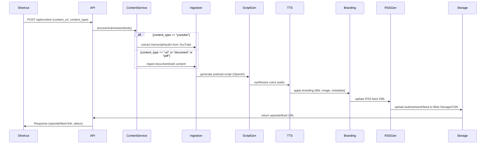

# Podcast Generation Sequence Diagram

```mermaid
sequenceDiagram
    participant Shortcut
    participant API
    participant ContentService
    participant Ingestion
    participant ScriptGen
    participant TTS
    participant Branding
    participant RSSGen
    participant Storage

    Shortcut->>API: POST /api/content (content_url, content_type)
    API->>ContentService: processSubmission(body)
    alt content_type == "youtube"
        ContentService->>Ingestion: extract transcript/audio from YouTube
    else content_type == "url" or "document" or "pdf"
        ContentService->>Ingestion: ingest document/web content
    end
    Ingestion->>ScriptGen: generate podcast script (OpenAI)
    ScriptGen->>TTS: synthesize voice audio
    TTS->>Branding: apply branding (title, image, metadata)
    Branding->>RSSGen: update RSS feed XML
    RSSGen->>Storage: upload audio/artwork/feed to Blob Storage/CDN
    Storage->>API: return episode/feed URL
    API->>Shortcut: Response (episode/feed link, status)
```
